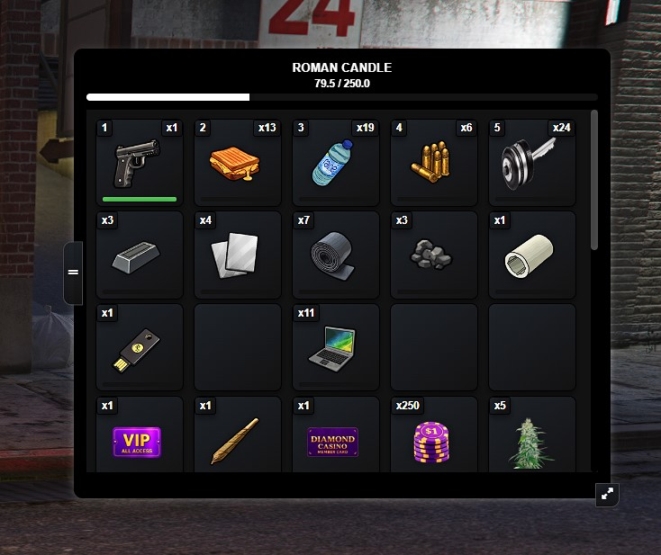
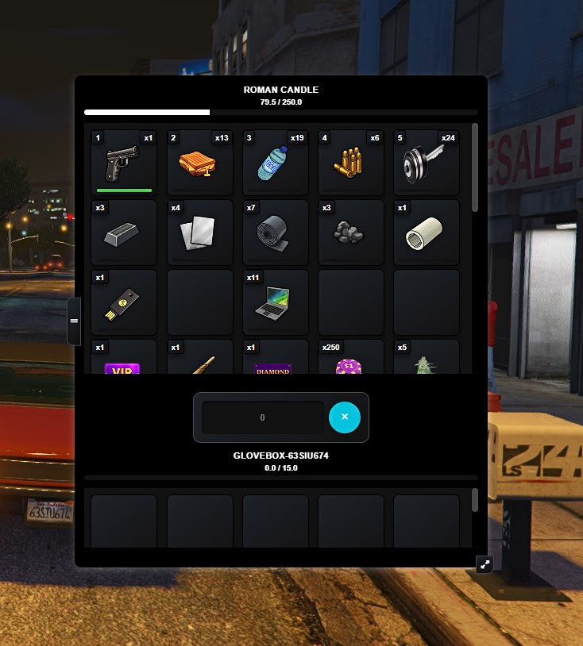
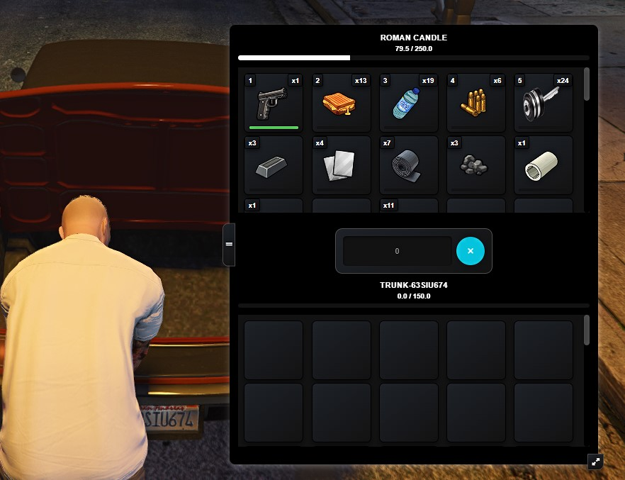
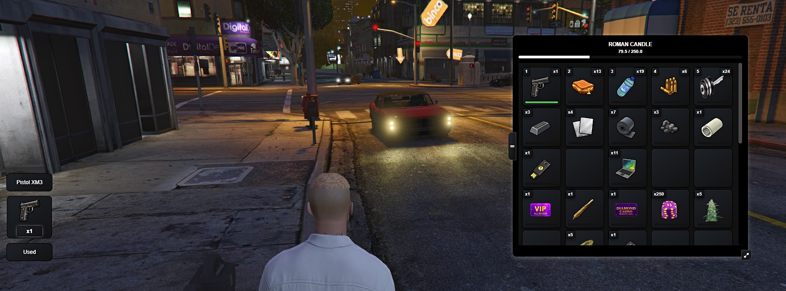
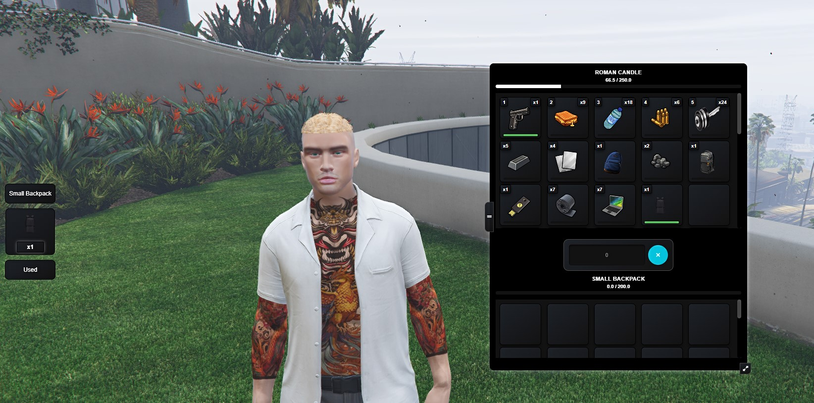
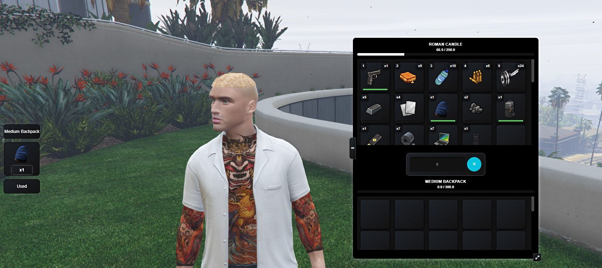
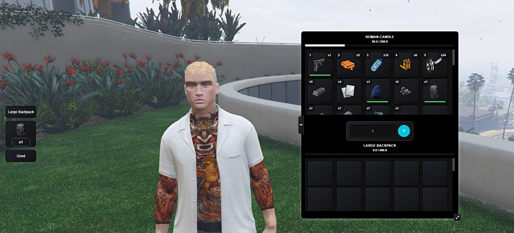

# qb-inventory v2.0.4
# Customized `qb-inventory` for QBCore, with a redesigned inventory UI, backpack support, currency storage guardrails, inventory window move/resize support, and ongoing cleanup for stale vehicle and drop inventories.

## Dependencies
- [qb-core](https://github.com/qbcore-framework/qb-core)
- [qb-smallresources](https://github.com/qbcore-framework/qb-smallresources) - for transfer logging and related history

## Features
- Stashes (personal and/or shared)
- Vehicle trunk & glovebox
- Weapon attachments
- Shops
- Item drops
- Backpack inventories
- Movable and resizable inventory window

## Documentation
https://docs.qbcore.org/qbcore-documentation/qbcore-resources/qb-inventory

## What is included in this version

## Screenshots

### Main Inventory

### Glovebox

### Trunk

### With Item Box

### With Backpacks

### Inventory redesign
This version includes a full visual pass over the standard `qb-inventory` layout.

What changed:
- cleaner overall layout and presentation
- updated spacing and structure for everyday use
- improved visual flow across the main inventory view
- support for the newer inventory and backpack handling used in this build

The goal with the redesign was simple: keep the inventory familiar, but make it feel cleaner, easier to read, and better to use for long sessions.

### Movable and resizable inventory window
The inventory window can now be repositioned and resized in a way that feels more natural in use.

What it does:
- adds a visible handle on the left side of the inventory for moving the window
- adds a resize grip in the bottom-right corner for resizing
- keeps the inventory inside screen boundaries so it cannot be dragged off-screen
- remembers the player’s saved position and size between uses
- automatically clamps saved values if the player changes resolution

Behavior notes:
- single-panel inventory keeps a fitted height so it does not stretch into empty space
- split inventory can make proper use of the extra room when another inventory is open
- the move/resize controls are separate from normal item drag and drop so they do not interfere with standard inventory use

This was added to make the inventory easier to place on different screen sizes and setups without making the UI feel cluttered.

### Backpack support
Backpacks are built into this resource through dedicated config and server handling.

Files:
- `config/backpacks.lua`
- `server/backpacks.lua`

What it does:
- adds usable backpack items with their own unique internal stash
- supports per-backpack slot and weight limits
- supports whitelist / blacklist item rules per backpack type
- prevents backpack nesting
- supports limits on how many backpacks a player can carry
- keeps backpack identity in item metadata so each backpack keeps its own storage

Default backpack items configured here:
- `backpack1`
- `backpack2`
- `backpack3`

If you want to add more backpacks, follow the same structure already used in `config/backpacks.lua`.

### Currency storage guardrails
This version includes guardrails for currency items so you can control where physical money can be moved.

File:
- `config/guardrails.lua`

Default protected items:
- `cash`
- `markedbills`

The guardrails can be toggled for:
- stashes
- vehicle storage
- backpack storage
- drops
- other player inventories

This gives you a clean way to stop cash or marked bills being moved into places you do not want them stored.

### Vehicle storage and inventory cleanup
This version includes cleanup support for stale vehicle inventories that build up over time.

Files:
- `config/cleanup.lua`
- `server/cleanup.lua`
- `server/maintenance.lua`
- `cleanup_orphan_vehicle_inventories.sql`

What it covers:
- cleanup of orphaned `trunk-*` inventories
- cleanup of orphaned `glovebox-*` inventories
- checks against `player_vehicles` so owned vehicles are kept intact
- scheduled cleanup support to stop the inventories table growing with junk entries

This is mainly there to deal with old temporary or invalid vehicle storage records that no longer belong to a real owned vehicle.

### Trunk and glovebox fixes
Vehicle storage is handled through the following files:
- `client/vehicles.lua`
- `config/vehicles.lua`
- server inventory open logic inside `server/commands.lua` and `server/functions.lua`

This version includes updated class-based trunk and glovebox storage values and the related logic needed to open the correct inventory type.

### Drop fixes and drop cleanup
Ground drops are included with cleanup controls so they do not hang around forever or leave junk behind in the database.

Relevant files:
- `client/drops.lua`
- `server/main.lua`
- `server/maintenance.lua`
- `config/config.lua`

What this version does:
- supports world item drops
- expires drops after the configured time
- gradually purges persisted `drop-*` inventories from the database
- avoids unnecessary long-term buildup from old drop entries

### Production tuning
This build also includes backend tuning aimed at keeping the inventory healthier on larger servers and long uptimes.

What changed:
- removed the full startup preload of the `inventories` table
- switched persisted inventory types to lazy loading instead of loading everything into memory at resource start
- added dirty-state tracking so non-player inventories are only saved when needed
- added batched background flushes for changed inventories
- flushes dirty inventories on close, resource stop, and txAdmin shutdown
- evicts idle cached inventories so memory use does not grow forever during long runs
- adds lightweight rate limiting around common inventory actions to reduce spam and abuse pressure
- cuts down routine production logging to avoid unnecessary console and disk noise

In plain terms, the inventory now does a better job of loading only what it needs, saving more intelligently, and not carrying around stale data forever.

## Configuration

### Main config
Main inventory settings are in:
- `config/config.lua`

Important sections in this version:
- max weight / slots
- stash size
- drop size
- keybinds
- drop expiry
- staggered DB purge for drops
- staggered orphan cleanup for vehicle inventories

### Backpack config
Backpack definitions live in:
- `config/backpacks.lua`

Each backpack can define:
- item name
- label
- slot count
- max weight
- whitelist
- blacklist

### Guardrail config
Currency movement rules live in:
- `config/guardrails.lua`

### Vehicle cleanup config
Scheduled orphan cleanup settings live in:
- `config/cleanup.lua`

## Database

### Base import
Import:
- `qb-inventory.sql`

### Migration from older inventory tables
If you are moving from an older `qb-inventory` setup, use:
- `migrate.sql`

That migration is intended to move saved inventory data from older tables into the current `inventories` table.

Older tables commonly replaced by this setup:
- `gloveboxitems`
- `stashitems`
- `trunkitems`

### Orphaned vehicle inventory cleanup
If your `inventories` table already contains old junk vehicle entries, use:
- `cleanup_orphan_vehicle_inventories.sql`

That cleanup is intended to remove orphaned `trunk-*` and `glovebox-*` records that no longer match a valid plate in `player_vehicles`.

## Installation
1. Place the resource in your `[qb]` folder.
2. Import `qb-inventory.sql`.
3. Run `migrate.sql` if you are coming from an older inventory table structure.
4. Run `cleanup_orphan_vehicle_inventories.sql` if you need to remove old orphaned vehicle inventory rows.
5. Make sure the resource is started in your server config.

## Notes
- Backpack items must exist in your shared items.
- Currency guardrails only apply to the configured item names.
- Vehicle orphan cleanup is designed to protect owned vehicles by checking against `player_vehicles`.
- Drop cleanup is staggered to avoid heavy database spikes.
- Saved inventory window position and size are stored client-side.
- Production tuning changes are aimed at reducing unnecessary memory use and database load, especially on larger servers.

## License

    QBCore Framework
    Copyright (C) 2021 Joshua Eger

    This program is free software: you can redistribute it and/or modify
    it under the terms of the GNU General Public License as published by
    the Free Software Foundation, either version 3 of the License, or
    (at your option) any later version.

    This program is distributed in the hope that it will be useful,
    but WITHOUT ANY WARRANTY; without even the implied warranty of
    MERCHANTABILITY or FITNESS FOR A PARTICULAR PURPOSE. See the
    GNU General Public License for more details.

    You should have received a copy of the GNU General Public License
    along with this program. If not, see <https://www.gnu.org/licenses/>.
